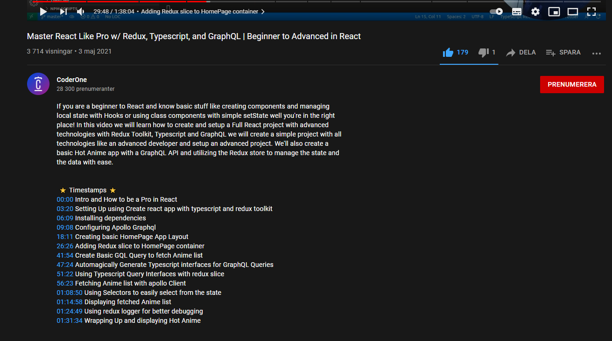

<h4 align="center" >
  Master React Like Pro w/ Redux, Typescript, and GraphQL 
</h4>

<div align = "center">

  
</div>


<div>
    Authors: 
  
  <p >
  <a href="https://www.youtube.com/watch?v=M_Oes39FNuk&t=20s">CodeOne</a>
</p>

  </div>
  
  ##
Status: Work In Progrss ⌛  (24/07-2021) -Done✅ ( 26/07-2021)


<div align="center">
<!--    -->
</div>


 <h2 align = 'left'>Technologies { </h2>
<p align="center">
  


</p>

<p align="center">
  <a href="https://www.youtube.com/watch?v=M_Oes39FNuk">Test it out</a>&nbsp;&nbsp;&nbsp;|&nbsp;&nbsp;&nbsp;
  <a href="https://wa.me/+46793351364?text=tja%20Jakob%20jag%20gillade%20din%20AnimeBooks%20app%20">My Network</a>
</p>

}


##
```
Authors:  {jakob yaro }
```
  
  

  


